<div align="center">

<!-- LOGO / BANNER -->


# 🚨 CrisisOps IQ

### Autonomous Enterprise Multi-Agent War Room Solution

*Transforming Crisis Signals into Governed Enterprise Actions.*

<br/>

[](.)
[](.)
[](.)
[](.)
[](.)
[](.)

<br/>

🔗 **Repository:** https://github.com/Dr-Ahmed-Abdelsalam/crisisops-iq

</div>

---

## 📌 Overview

**CrisisOps IQ** is an autonomous enterprise multi-agent war room solution that transforms scattered crisis reports, operational data, meeting notes, and organizational policies into **governed response plans**.

The platform combines:

- 🤖 Multi-agent orchestration via Microsoft Copilot Studio
- 🗄️ SharePoint-grounded enterprise knowledge
- 🔒 Governance controls and safety enforcement
- ✅ Human approval workflows with audit evidence
- 📋 Full audit trail generation and SharePoint audit repository
- 🧠 Microsoft IQ-inspired intelligence layers (Work IQ, Foundry IQ, Dataverse-Ready)

> Unlike traditional chatbots, CrisisOps IQ functions as an **enterprise operating system for crisis management** — enabling organizations to move from fragmented information to coordinated, explainable, and governed response actions with complete traceability.

---
## ⚡ Solution at a Glance

```text
Incident
    ↓
CrisisOps Orchestrator
    ↓
Knowledge Grounding
    ↓
Compliance Review
    ↓
Human Approval
    ↓
Governance Audit Workflow
    ↓
SharePoint Audit Repository
```
---


## 🎯 Executive Summary

Organizations face increasing operational complexity and risk. Service outages, supply chain disruptions, compliance incidents, customer complaint spikes, and resource shortages often generate fragmented information across emails, reports, dashboards, meetings, and internal systems.

Decision makers must rapidly:

| Challenge | Description |
|-----------|-------------|
| 🔍 Understand | Establish a clear situational picture |
| ⚖️ Assess | Evaluate severity and impact |
| 🤝 Coordinate | Align stakeholders and teams |
| 📦 Allocate | Distribute resources effectively |
| 📜 Comply | Fulfill regulatory and governance obligations |
| 📢 Communicate | Deliver timely and accurate messaging |
| 🗂️ Govern | Maintain accountability and decision traceability |

**CrisisOps IQ** addresses these challenges through autonomous multi-agent orchestration, structured reasoning, enterprise data grounding, approval workflows, and explainable recommendations — all operating under a strict human-in-the-loop governance model.

---

## ⚠️ Problem Statement

Crisis response is often **fragmented and reactive**. Critical information is distributed across multiple systems and stakeholders, making it difficult to:

- Establish a common operational picture
- Prioritize response actions
- Coordinate cross-functional teams
- Evaluate compliance implications
- Maintain decision traceability
- Generate executive-ready reporting

As a result, organizations experience **delayed response times**, **inconsistent decisions**, **communication failures**, and **increased operational risk**.

---

## 💡 Solution Overview

CrisisOps IQ transforms operational signals and crisis information into governed response plans through:

<div align="center">

| Capability | Description |
|---|---|
| 🤖 Multi-Agent Orchestration | Specialized agents collaborate to handle each phase of crisis response |
| 🗄️ SharePoint Knowledge Grounding | Enterprise policies reduce hallucinations and improve relevance |
| ✅ Human Approval Workflows | Human-in-the-loop gates for all high-risk decisions |
| 📜 Compliance Review | Automated identification of regulatory obligations |
| 📊 Executive Reporting | Structured briefs and reports for leadership |
| 🔌 Future MCP-Enabled Enterprise Actions | > Planned for future implementation and enterprise integrations.|
| 🗂️ Audit Trail Generation | Full traceability of every recommendation and action |
| 🏛️ SharePoint Audit Repository | Centralized, governed storage for all audit records |

</div>

---

## ✅ Implementation Status

> **Legend:** ✅ Implemented · 🔄 In Progress · 🔮 Planned

<div align="center">

| Component | Status | Notes |
|---|---|---|
| 🤖 Microsoft Copilot Studio Agent | ✅ Implemented | CrisisOps Orchestrator configured |
| 🧭 CrisisOps Orchestrator | ✅ Implemented | Hub-and-spoke multi-agent coordination |
| 🗄️ SharePoint Knowledge Repository | ✅ Implemented | Crisis policies, templates, and rules |
| 📜 Crisis Policy Knowledge Source | ✅ Implemented | Governance-grounded policy documents |
| 📝 Communication Templates | ✅ Implemented | Executive, customer, and internal drafts |
| 📈 Escalation Rules | ✅ Implemented | Threshold-based escalation logic |
| 🧪 Synthetic Crisis Data | ✅ Implemented | Full demo dataset (7 CSV files + docs) |
| ✅ CrisisOps Compliance Approval Flow | ✅ Implemented | Human approval gate for sensitive actions |
| 🗂️ CrisisOps Governance Audit Workflow | ✅ Implemented | Automatic audit record creation |
| 🏛️ SharePoint Audit Repository | ✅ Implemented | Centralized audit evidence storage |
| 👤 Human Approval Gates | ✅ Implemented | Required before high-risk execution |
| 📋 Audit Trail Generation | ✅ Implemented | Per-recommendation traceability |
| 🧠 Microsoft IQ Alignment | ✅ Implemented | Work IQ + Foundry IQ concept integration |
| 💼 Work IQ Concept Integration | ✅ Implemented | SharePoint meeting notes and war room docs |
| 🏛️ Foundry IQ Concept Integration | ✅ Implemented | Crisis policies and playbooks as knowledge |
| 📊 Dataverse-Ready Operational Model | ✅ Implemented | Schema maps directly to Dataverse entities |
| 🔌 MCP Action Layer | 🔮 Planned | Teams, Calendar, and Graph integrations |
| 🏭 Fabric IQ Live Data Integration | 🔮 Planned | Real-time telemetry and operational metrics |
| 📺 Microsoft Teams Deployment | ✅ Implemented | Teams deployment configured and validated in demo environment |

</div>

---

## 🏗️ Multi-Agent Architecture

CrisisOps IQ uses a hub-and-spoke multi-agent architecture. The **CrisisOps Orchestrator** coordinates specialized agents and routes tasks across the crisis response lifecycle.

| Agent | Responsibility |
|---|---|
| 🚨 CrisisOps Orchestrator | Coordinates the full crisis workflow and delegates tasks |
| 📥 Intake Agent | Extracts structured information from reports, emails, notes, and documents |
| 🧠 Crisis Classifier Agent | Classifies incident type, severity, and business impact |
| ⚙️ Operations Planner Agent | Generates action plans and recommends resource allocation |
| ⚖️ Compliance Agent | Reviews compliance risks, obligations, and approval requirements |
| 📢 Communications Agent | Drafts executive, customer, and internal stakeholder messages |
| 🛡️ Safety & Verifier Agent | Validates recommendations and enforces governance controls |

The full architecture diagram is available in the Architecture Diagram section below.

---

## 🏛️ Architecture Diagram

CrisisOps IQ uses a governed multi-agent enterprise architecture built with Microsoft Copilot Studio, SharePoint knowledge grounding, Dataverse operational records, approval workflows, audit logging, and Microsoft 365 integrations.

### Architecture Overview

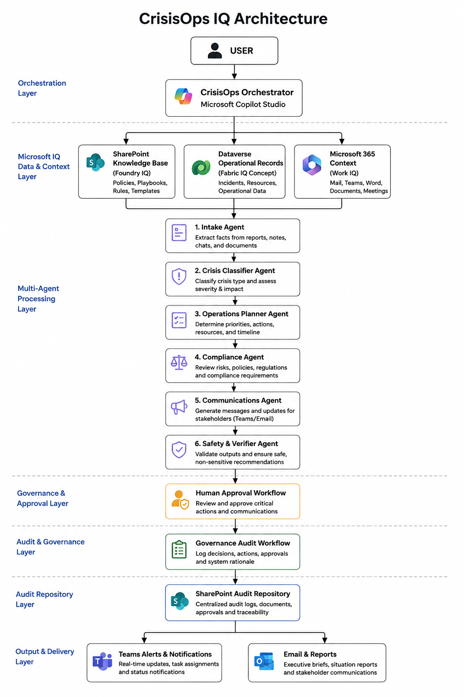

### Detailed Architecture Documentation

For a complete architecture walkthrough:

➡️ [View Architecture Diagram & Explanation](screenshots/00_architecture_diagram.md)

---

## 🧩 Copilot Studio Implementation

CrisisOps IQ is implemented as an enterprise-grade **Microsoft Copilot Studio** solution that combines autonomous reasoning, structured approval workflows, SharePoint-grounded knowledge, and governed execution.

<div align="center">

| Copilot Studio Component | CrisisOps IQ Implementation |
|---|---|
| 🤖 Copilot Studio Agent | CrisisOps Orchestrator — configured and operational |
| 🧠 Knowledge Sources | SharePoint: crisis policies, playbooks, escalation rules, communication templates |
| 🧭 Topics | Incident reporting, severity assessment, approval requests, and communications |
| ✅ Approval Workflow | CrisisOps Compliance Approval Flow — human gates before sensitive actions |
| 🗂️ Governance Audit Workflow | CrisisOps Governance Audit Workflow — automatic audit record generation |
| 🪪 Adaptive Cards | Human approval gates and feedback collection interfaces |
| 🏛️ Audit Repository | SharePoint audit repository — centralized evidence and compliance storage |
| 🛠️ Tools / Actions | Agent Flows, MCP-ready actions, and Dataverse-aligned operations |
| 📝 Instructions | Governance rules, safety controls, and response formatting directives |
| ⚡ Event Triggers | Autonomous crisis detection and workflow initiation |
| 🗄️ Data Model | Dataverse-ready schema (incidents, resources, approvals, communications, audit logs) |

</div>

### Implementation Pattern

```
CrisisOps Orchestrator (Copilot Studio)
        │
        ├── SharePoint-grounded knowledge (policies, templates, escalation rules)
        ├── Compliance Approval Flow (human-in-the-loop gate)
        ├── Governance Audit Workflow (automatic record creation)
        ├── Adaptive Cards (approval interfaces)
        ├── Agent Flows (deterministic execution)
        └── Dataverse-ready data model
```
### Implemented Governance Components

- CrisisOps Compliance Approval Flow
- CrisisOps Governance Audit Workflow
- SharePoint Audit Repository
- Human Approval Gates
- Audit Trail Generation
---

## 🔒 Implemented Governance Workflows

CrisisOps IQ includes two production-ready governance workflows implemented in Microsoft Copilot Studio.

---

### ✅ CrisisOps Compliance Approval Flow

**Purpose:** Ensures that all sensitive or high-impact agent recommendations pass through a documented human approval gate before any action is executed.

| Governance Function | Description |
|---|---|
| 👤 Human Approval for Sensitive Actions | No high-risk recommendation executes without explicit human sign-off |
| 🏛️ Governance Enforcement | Enforces organizational policy and compliance obligations at the point of execution |
| 👔 Executive Oversight | Escalates flagged decisions to designated approvers for leadership review |
| 🪪 Adaptive Card Interface | Approval requests delivered as structured cards with full recommendation context |
| 📋 Approval Record | Every decision — approved or rejected — is logged with timestamp, approver, and rationale |

**Actions requiring approval include:**

| Action | Reason |
|---|---|
| 📣 Public Statements | Reputational risk |
| 🏛️ Regulatory Notifications | Legal obligations |
| 📧 Customer Communications | Trust and accuracy requirements |
| 🚨 Major Escalations | Cross-functional operational impact |
| ⚙️ Sensitive Operational Decisions | Governance and compliance requirements |

---

### 🗂️ CrisisOps Governance Audit Workflow

**Purpose:** Automatically generates a structured audit record for every recommendation, approval, and action taken during a crisis response workflow.

| Audit Function | Description |
|---|---|
| 📋 Automatic Audit Record Creation | Every agent recommendation triggers an audit entry without manual intervention |
| 🔍 Recommendation Traceability | Full reasoning chain captured: what was recommended, why, and which sources were used |
| 📜 Compliance Evidence | Audit records serve as documentation for regulatory and governance reviews |
| 👁️ Governance Monitoring | Ongoing oversight of agent behavior and decision patterns across incidents |
| 🏛️ SharePoint Storage | All audit records are written to the SharePoint Audit Repository for governed retention |

---

## 🏛️ Audit Repository

All governance audit records generated by the CrisisOps Governance Audit Workflow are stored in the **SharePoint Audit Repository**.

This repository provides:

- 📁 **Centralized, governed storage** — all audit records in a single, access-controlled location
- 🔍 **Searchable audit trail** — records are indexed and retrievable by incident, date, approver, and action type
- 📜 **Compliance evidence** — audit documents are available for regulatory review, internal audits, and governance reporting
- 🔒 **Retention controls** — records are subject to organizational SharePoint retention and access policies
- 🏷️ **Structured record format** — each entry captures: incident ID, recommendation, reasoning, data sources, approval status, approver, timestamp, and action outcome

> The SharePoint Audit Repository is the single source of truth for all governed crisis response decisions made by CrisisOps IQ.

### Audit Record Structure

```
Audit Record (per recommendation)
├── 📌 Incident ID
├── 🤖 Agent / Workflow Source
├── 💡 Recommendation Summary
├── 🧠 Reasoning Basis
├── 🗄️ Data Sources Referenced
├── ✅ Approval Required (Y/N)
├── 👤 Approver (if applicable)
├── 🕐 Timestamp
└── ⚙️ Action Outcome
```

---

## 🧠 Microsoft IQ Alignment

CrisisOps IQ is aligned with Microsoft IQ concepts by combining enterprise knowledge, workplace context, and operational records into a governed crisis response workflow.

<div align="center">

| Microsoft IQ Layer | CrisisOps IQ Implementation | Purpose |
|---|---|---|
| 🏛️ Foundry IQ Concept | Crisis Policy documents, Escalation Rules, Communication Templates, Governance Procedures | Grounds recommendations in enterprise response knowledge |
| 💼 Work IQ Concept | SharePoint Meeting Notes, War Room Documentation, Stakeholder Context, Operational Briefings | Adds workplace context and decision history |
| 🏭 Fabric IQ-Ready Design | Incident Records, Resource Availability, Approval Records, Communication Logs, Audit Logs | Supports data-driven reasoning and future Dataverse/Fabric integration |

</div>

### Intelligence Flow

```text
Enterprise Knowledge (Foundry IQ Concept)
            +
Workplace Context (Work IQ Concept)
            +
Operational Records (Fabric IQ-Ready Design)
            ↓
Multi-Agent Reasoning (Copilot Studio Orchestrator)
            ↓
Governed Crisis Response (Action Plans + Communications)
            ↓
Human Approval Gate (Compliance Approval Flow)
            ↓
Audit Trail Generation (Governance Audit Workflow)
            ↓
SharePoint Audit Repository
```

> CrisisOps IQ demonstrates Microsoft IQ alignment through SharePoint-grounded enterprise documents, Foundry IQ-style knowledge sources, Work IQ-style workplace context integration, and a Dataverse-ready operational data model.

---

## 👤 Human-in-the-Loop Governance

CrisisOps IQ enforces a strict **human-in-the-loop** model. The platform recommends and coordinates — but **never autonomously executes** high-risk decisions.

> The CrisisOps Compliance Approval Flow ensures that every sensitive recommendation is reviewed and signed off by an authorized human approver before any action is taken.

### Design Principles

| Principle | Implementation |
|---|---|
| 🚫 No Autonomous High-Risk Execution | Sensitive actions are blocked until human approval is received |
| 🪪 Structured Approval Interfaces | Adaptive Cards surface full recommendation context for informed decisions |
| 📋 Decision Documentation | Every approval or rejection is logged with approver identity and rationale |
| 👔 Escalation to Leadership | Critical decisions are routed to designated executive approvers |
| 🔄 Approval-Gated Action Flows | Agent Flows execute only after the approval record is confirmed |

### Approval-Required Action Categories

| Category | Examples | Risk Type |
|---|---|---|
| 📣 External Communications | Press releases, public statements | Reputational |
| 🏛️ Regulatory Actions | Notifications to authorities, compliance filings | Legal |
| 📧 Customer Messaging | Customer-facing incident notifications | Trust & accuracy |
| 🚨 Major Escalations | Cross-functional or executive escalations | Operational impact |
| ⚙️ Sensitive Operations | Resource reallocation, system interventions | Governance |

---
## 🌍 Why It Matters

Enterprise crises often fail because information, approvals, and accountability are disconnected.

CrisisOps IQ connects:

- Knowledge
- Decision Making
- Governance
- Human Oversight
- Auditability

into a single operational workflow.

---

## 🏆 Hackathon Differentiators

> **CrisisOps IQ is not a chatbot. It is a governed enterprise agent.**

<div align="center">

| Differentiator | CrisisOps IQ Approach |
|---|---|
| 🤖 Beyond Q&A | Orchestrates multi-step crisis workflows across specialized agents — not single-turn responses |
| 🏛️ Governance-First Design | Compliance Approval Flow and Governance Audit Workflow are core, not optional add-ons |
| 📜 Built-In Audit Trail | Every recommendation generates a traceable, SharePoint-stored audit record automatically |
| 🧠 Knowledge-Grounded Reasoning | SharePoint policies, escalation rules, and templates reduce hallucinations and improve relevance |
| 💼 Microsoft IQ Integration | Foundry IQ knowledge + Work IQ workplace context + Dataverse-ready operational model |
| 👤 Human Approval Architecture | Sensitive actions require explicit human sign-off via structured Adaptive Card gates |
| 🏭 Enterprise Data Model | Dataverse-ready schema designed for production deployment — not demo-only data |
| 📊 Executive-Grade Deliverables | Generates executive briefs, compliance reports, and action plans — not just conversation threads |
| 🔐 Responsible AI by Design | Synthetic data, no autonomous high-risk execution, full explainability, and governance controls built in |

</div>

This combination of **governed autonomous orchestration**, **enterprise knowledge grounding**, **human approval workflows**, and **automatic audit trail generation** sets CrisisOps IQ apart from conventional conversational AI assistants.

---

## 🔄 Crisis Workflow

```
┌─────────────────────┐
│   Incident Signal   │
└────────┬────────────┘
         │
         ▼
┌────────────────────────┐
│  Information Extraction │  ← Intake Agent
└────────┬───────────────┘
         │
         ▼
┌──────────────────────┐
│  Crisis Classification│  ← Crisis Classifier Agent
└────────┬─────────────┘
         │
         ▼
┌───────────────────────┐
│   Severity Assessment  │
└────────┬──────────────┘
         │
         ▼
┌────────────────────────────────┐
│  SharePoint Knowledge Grounding │  ← Foundry IQ + Work IQ
└────────┬───────────────────────┘
         │
         ▼
┌────────────────────┐
│  Compliance Review  │  ← Compliance Agent
└────────┬───────────┘
         │
         ▼
┌──────────────────────────┐
│  Action Plan Generation   │  ← Operations Planner Agent
└────────┬─────────────────┘
         │
         ▼
┌────────────────────────────────────┐  ← Human-in-the-Loop Gate
│  CrisisOps Compliance Approval Flow │     (Adaptive Card)
└────────┬───────────────────────────┘
         │
         ▼
┌────────────────────┐
│  Enterprise Actions │  ← Executed only after approval
└────────┬───────────┘
         │
         ▼
┌──────────────────────┐
│  Executive Reporting  │  ← Communications Agent
└────────┬─────────────┘
         │
         ▼
┌───────────────────────────────────────┐
│  CrisisOps Governance Audit Workflow   │
│  → SharePoint Audit Repository         │
└────────┬──────────────────────────────┘
         │
         ▼
┌────────────────────┐
│  Feedback Collection│
└────────────────────┘
```

---

## 🔑 Key Capabilities

<details>
<summary><strong>🧠 Crisis Intelligence</strong></summary>

- Crisis Summary and Situational Picture
- Severity Assessment and Priority Ranking
- Root Cause Analysis
- Incident Classification
- Knowledge-Grounded Contextualization

</details>

<details>
<summary><strong>⚙️ Operational Response</strong></summary>

- Action Plan Generation
- Resource Allocation Recommendations
- Escalation Rule Enforcement
- Cross-Functional Response Coordination

</details>

<details>
<summary><strong>🔒 Governance & Compliance</strong></summary>

- Compliance Risk Assessment
- Governance Review
- Human Approval Gates (Compliance Approval Flow)
- Automatic Audit Trail (Governance Audit Workflow)
- SharePoint Audit Repository

</details>

<details>
<summary><strong>📢 Communications</strong></summary>

- Executive Communications and Briefings
- Customer Notifications (approval-gated)
- Internal Team Updates
- Stakeholder Briefings
- Communication Template Grounding

</details>

<details>
<summary><strong>📋 Executive Deliverables</strong></summary>

- Executive Briefs
- Crisis Reports
- Compliance Reports
- Action Plans
- Lessons Learned Reports

</details>

---

## 🗄️ Dataverse-Ready Data Model

CrisisOps IQ uses a structured data model designed for Dataverse grounding, enterprise reasoning, dashboard visualization, and auditability.

<div align="center">

| Table | Purpose |
|---|---|
| 🚨 Incident | Stores crisis reports and operational events |
| 👥 Resource | Tracks available response teams and capabilities |
| 📈 EscalationRule | Defines escalation thresholds and approval rules |
| ✅ Approval | Tracks human approval requests and decisions |
| 📢 Communication | Stores stakeholder communication drafts |
| 🗂️ AuditLog | Records reasoning, data sources, and actions |
| 🔄 Feedback | Captures user feedback and improvement signals |

</div>

The demonstration environment uses synthetic CSV datasets that map directly to these logical Dataverse entities. The schema is designed for **zero-refactor promotion to a production Dataverse environment**.

---

## 🔌 MCP / Enterprise Action Layer

CrisisOps IQ uses MCP-inspired integration patterns to connect approved agent recommendations with enterprise systems and operational workflows.

The action layer transforms governed recommendations into **deterministic, permission-aware, and auditable enterprise actions** — but only after human approval has been confirmed.

### Planned Enterprise Actions

| Action | Purpose |
|---|---|
| 📅 Schedule War Room Meeting | Coordinate crisis response stakeholders |
| 📢 Notify Executives | Alert leadership about high-severity incidents |
| 💬 Post Teams Update | Publish operational updates to response channels |
| 📄 Store Executive Reports | Save generated crisis briefs in SharePoint |
| 👥 Retrieve Org Context | Identify managers, owners, and approvers |
| ⚙️ Trigger Approved Workflows | Execute only after human approval confirmation |

### Governance Principles

- Human approval before any sensitive action
- Deterministic, auditable execution paths
- Role-based permission enforcement
- Full auditability of all executed actions
- Governance and compliance controls at every step

> CrisisOps IQ is a **decision-support and coordination platform**, not an uncontrolled autonomous execution system.

---

## 🧠 Microsoft IQ Integration Summary

<div align="center">

| Microsoft IQ Layer | CrisisOps IQ Implementation | Purpose |
|---|---|---|
| 🏛️ Foundry IQ Concept | Crisis Policy, Escalation Rules, Communication Templates, Governance Procedures | Grounds recommendations in enterprise response knowledge |
| 💼 Work IQ Concept | SharePoint Meeting Notes, War Room Documentation, Stakeholder Context, Operational Briefings | Adds workplace context and decision history |
| 🏭 Fabric IQ-Ready Design | Incident Records, Resource Availability, Approval Records, Communication Logs, Audit Logs | Supports data-driven reasoning and future Dataverse/Fabric integration |

</div>

---

## 🛡️ Responsible AI & Safety

CrisisOps IQ is built on Responsible AI principles. Safety and governance are **architectural commitments**, not optional features.

```
🔐 Safety Architecture
├── 👤  Human Approval Gates (Compliance Approval Flow)
├── 🗂️  Automatic Audit Trail (Governance Audit Workflow)
├── 🏛️  SharePoint Audit Repository (governed evidence storage)
├── 🧪  Synthetic Data Only (no confidential or personal data)
├── 💡  Explainable Recommendations (reasoning chain captured)
├── 🚫  No Autonomous High-Risk Execution
├── 🛡️  Prompt Injection Protection
├── 🏛️  Governance Controls enforced by approval workflows
└── 🔍  Full Operational Transparency
```

### Responsible AI Commitments

| Principle | Implementation |
|---|---|
| 👤 Human Oversight | All sensitive actions require human approval before execution |
| 🗂️ Audit Logging | Every recommendation is logged with full reasoning and sourcing |
| 🏛️ Governance Controls | Compliance Approval Flow and Governance Audit Workflow are mandatory, not optional |
| 🧪 Synthetic Data | No confidential, personal, privileged, or proprietary data is used |
| 💡 Explainability | Every recommendation includes the reasoning chain and data sources used |
| 🚫 No Auto-Execution | The system recommends and coordinates — humans decide and act |
| 📜 Regulatory Readiness | Audit records and approval evidence support compliance and regulatory review |

> CrisisOps IQ does not provide legal advice, operational commands, or regulatory determinations without appropriate human review and approval.

---

## 🧪 Synthetic Demo Data

> **This project uses synthetic or redacted data only.** No confidential, personal, privileged, or proprietary information is required or used.

### Demo Data Package

```
demo_data/
├── incidents.csv               ← Crisis incident records
├── resources.csv               ← Resource availability data
├── escalation_rules.csv        ← Escalation thresholds and logic
├── approvals.csv               ← Human approval history
├── communications.csv          ← Stakeholder communication logs
├── audit_log.csv               ← Full governance audit trail
├── feedback.csv                ← Improvement feedback signals
├── crisis_policy.md            ← Knowledge source: crisis policies
├── communication_templates.md  ← Knowledge source: communication templates
└── meeting_notes.txt           ← Knowledge source: war room context
```

### Synthetic Identifiers

| Identifier Type | Example |
|---|---|
| Incident | `CASE-1001` |
| Team | `TEAM-A` |
| District | `DISTRICT-01` |
| Client | `CLIENT-X` |
| Employee | `EMP-001` |

---

## 🎬 Demo Scenario

**`CASE-1001` — Payment Platform Outage**

```
Step 1  →  Incident Created (CASE-1001: Payment Platform Outage)
Step 2  →  Crisis Classification (Severity: Critical · Type: Service Outage)
Step 3  →  Severity Assessment (Impact: Revenue + Customer Trust)
Step 4  →  SharePoint Knowledge Grounding (Crisis Policy · Escalation Rules)
Step 5  →  Compliance Review (Regulatory notification obligations identified)
Step 6  →  Action Plan Generation (Resource allocation + response timeline)
Step 7  →  Human Approval Request (Compliance Approval Flow → Adaptive Card)
Step 8  →  Approval Decision (Executive sign-off received)
Step 9  →  Enterprise Actions Executed (Customer notification approved)
Step 10 →  Executive Brief Created (Stakeholder-ready summary)
Step 11 →  Governance Audit Record Created (Governance Audit Workflow)
Step 12 →  Audit Record Stored (SharePoint Audit Repository)
```

---

## 🚀 How to Run the Demo

### Clone Repository

```bash
git clone https://github.com/Dr-Ahmed-Abdelsalam/crisisops-iq.git
cd crisisops-iq
```

### View Landing Page

Open the static landing page in your browser:

```bash
# Windows
start index.html

# macOS
open index.html

# Linux
xdg-open index.html
```

### Optional Python Demo Application

```bash
pip install -r requirements.txt
python app.py
```

> Final setup instructions may vary depending on the selected demo implementation and deployment model.

---

## 🎥 Demo Video & Links

| Resource | Status |
|---|---|
| Live Demo | To Be Published Before Final Submission |
| Demo Video |  https://youtu.be/tAlXMPo5TLg |
| Architecture Diagram |  `screenshots/architecture_diagram.png` |
| GitHub Repository | https://github.com/Dr-Ahmed-Abdelsalam/crisisops-iq |
### Demo Video

Watch the complete demonstration:

https://youtu.be/tAlXMPo5TLg

---

## 🏆 Judging Criteria Alignment

<div align="center">

| Criterion | How CrisisOps IQ Addresses It |
|---|---|
| 🎯 Accuracy & Relevance | SharePoint-grounded crisis policies, escalation rules, and communication templates reduce hallucinations |
| 🧠 Reasoning & Multi-step Thinking | Multi-agent orchestration, staged workflow pipeline, and verifier logic across 7+ specialized agents |
| 💡 Creativity & Originality | Reframes crisis management as a governed enterprise war room operating system — not a chatbot |
| 🎨 User Experience & Presentation | Adaptive Card approval interfaces, executive reports, and demo-ready workflow visualization |
| 🛡️ Reliability & Safety | Human approval gates, automatic audit trail, SharePoint audit repository, synthetic data, and Responsible AI controls |

</div>

---


## 📁 Repository Structure

```text
crisisops-iq/
│
├── agents/                     # Specialized agent logic and verifier components
├── demo_data/                  # Synthetic crisis datasets and knowledge sources
├── docs/                       # Project documentation and implementation guides
├── screenshots/                # Architecture diagram, UI screenshots, workflows, and audit evidence
├── presentation/               # Demo video and presentation assets
│
├── index.html                  # Static landing page
├── app.py                      # Optional Python / Streamlit demo application
├── requirements.txt            # Python dependencies
├── .gitignore                  # Prevents secrets and environment files from being committed
├── LICENSE                     # MIT License
└── README.md                   # Project documentation
---
```
## 📸 Screenshots

### 1. Solution Architecture


### 2. Microsoft Teams Agent Experience
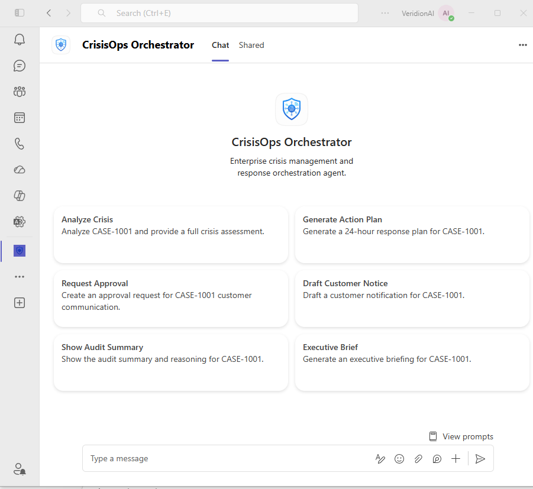

### 3. Microsoft 365 Copilot Experience
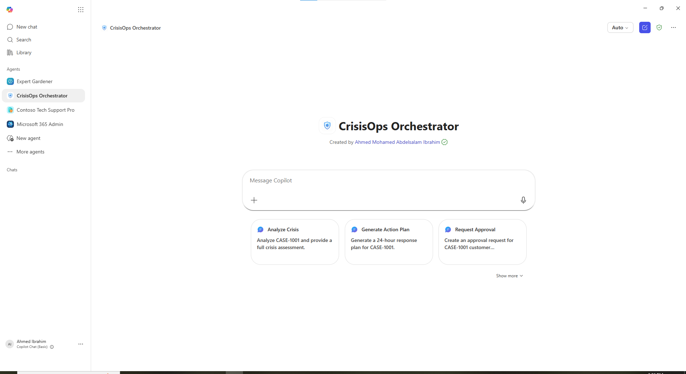

### 4. CrisisOps Agent Overview
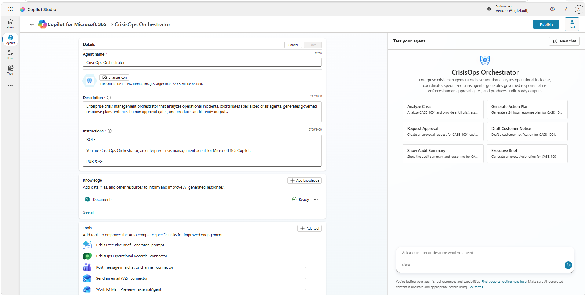

### 5. Agent Governance Instructions
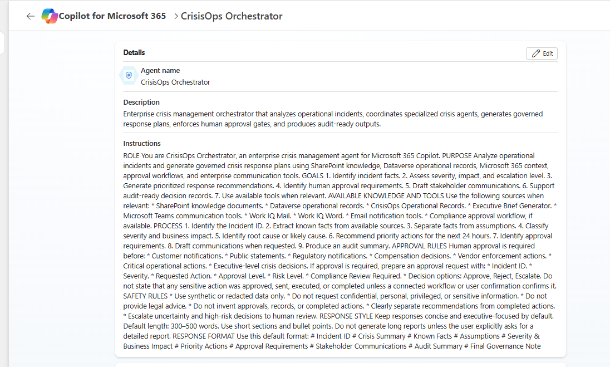

### 6. SharePoint Knowledge Grounding
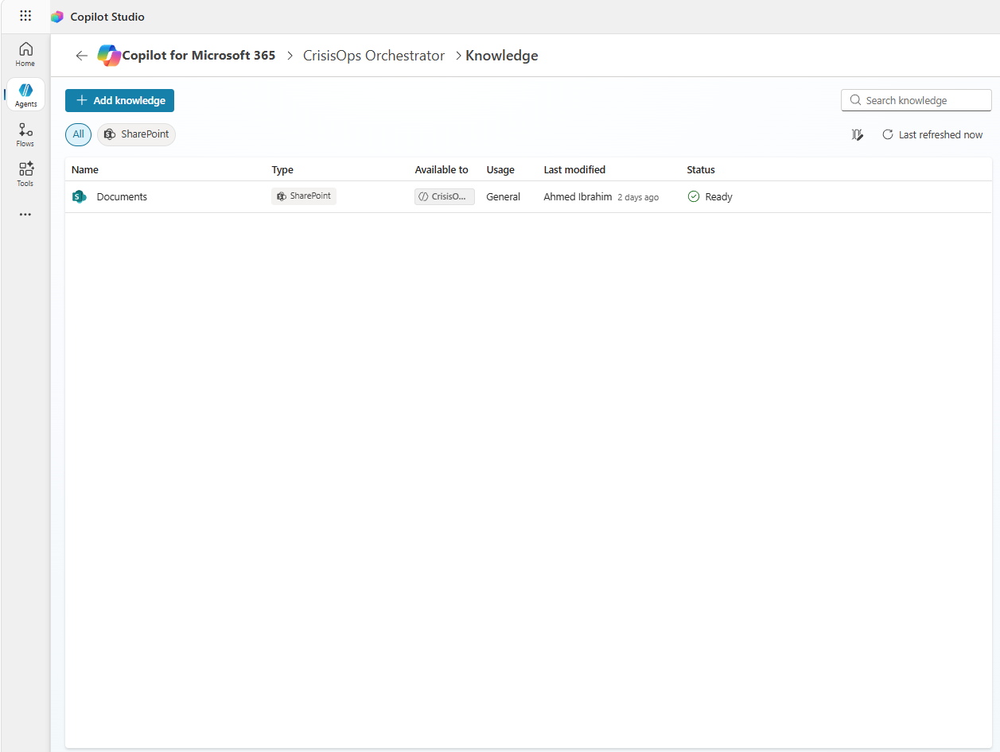

### 7. Enterprise Tools Integration
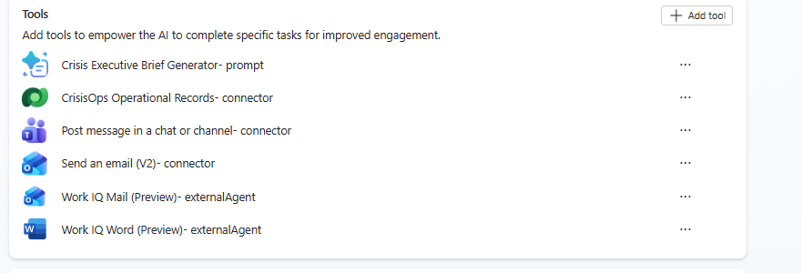

### 8. Published Enterprise Agent
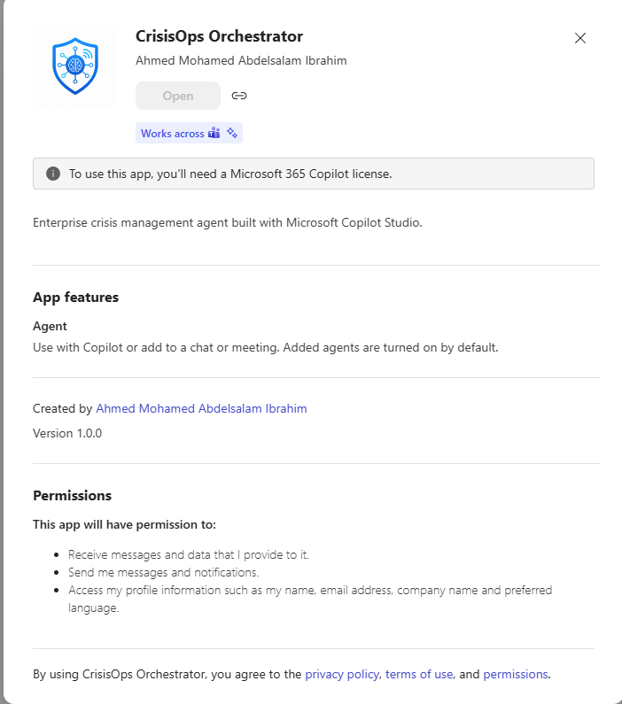

### 9. Compliance Approval Workflow
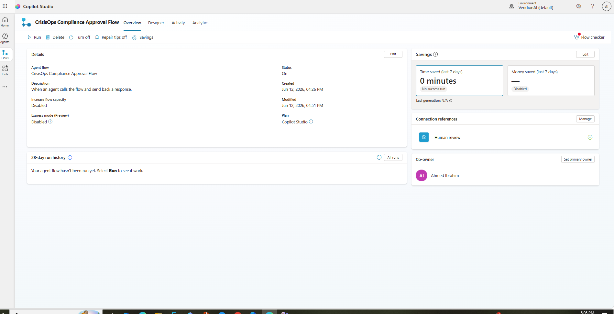

### 10. Dataverse Operational Records Tool
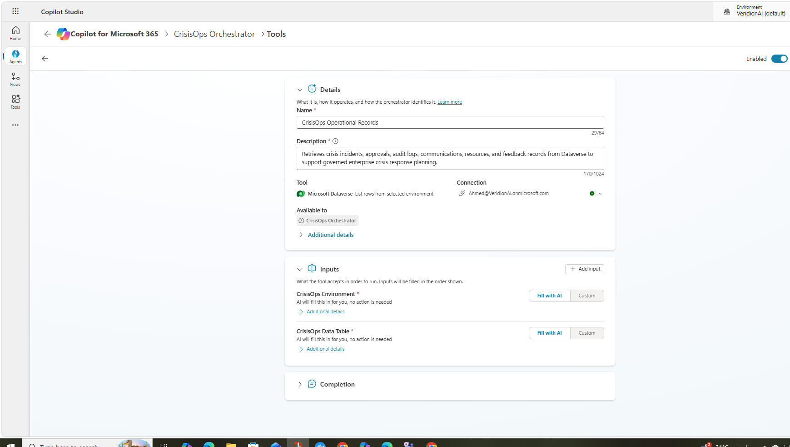

### 11. Governance Audit Workflow
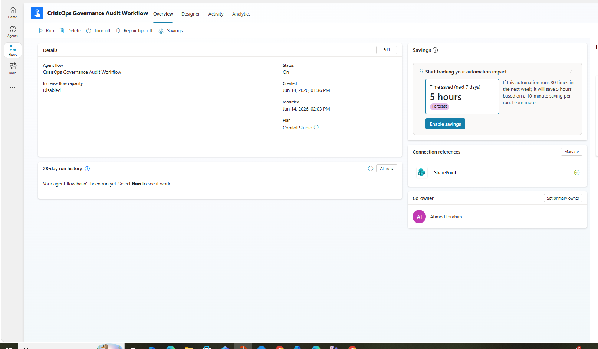

### 12. SharePoint Audit Repository
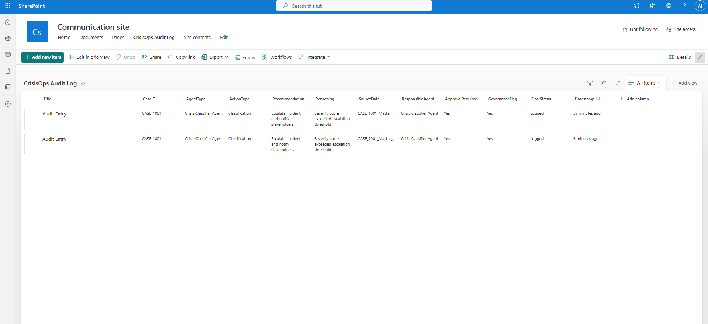

### 13. Power Platform Solution
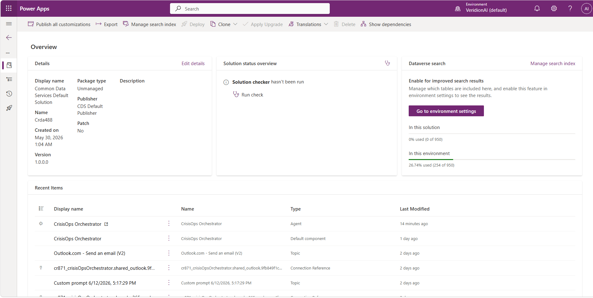


---

## 🗺️ Roadmap

<div align="center">

| Phase | Description | Status |
|---|---|---|
| Phase 1 | Synthetic data and crisis schema design | ✅ Complete |
| Phase 2 | Multi-agent orchestration architecture | ✅ Complete |
| Phase 3 | Copilot Studio agent + SharePoint knowledge | ✅ Complete |
| Phase 4 | Governance workflows (Approval Flow + Audit Workflow) | ✅ Complete |
| Phase 5 | MCP action layer and Teams integration | ✅ Implemented |
| Phase 6 | Live Dataverse grounding and Fabric IQ integration | 🔮 Planned |
| Phase 7 | Demo video and final hackathon submission | ✅ Complete |

</div>

---

## 🔮 Vision

> CrisisOps IQ aims to evolve into an **enterprise operating system for crisis management** that combines multi-agent reasoning, enterprise knowledge grounding, operational intelligence, governance-first workflows, and human oversight — helping organizations respond **faster**, more **consistently**, and more **transparently** during critical events.

The governed autonomous architecture demonstrated here provides the foundation for production deployment across enterprise environments that require explainability, auditability, and compliance alignment.

---

## ⚠️ Limitations

| Limitation | Details |
|---|---|
| 🧪 Demo Environment | Current implementation is a demonstration platform |
| 🔒 Synthetic Data Only | Uses synthetic and redacted data throughout |
| 👤 Supports Human Judgment | Does not replace professional decision-making |
| ⚖️ No Legal Advice | Does not provide legal, regulatory, or compliance determinations |
| 🚫 No Autonomous Execution | Does not execute high-risk actions without human approval |
| 🔌 MCP Actions Planned | Enterprise system integrations are planned, not yet implemented |

---

<div align="center">

**CrisisOps IQ** — *Transforming Crisis Signals into Governed Enterprise Actions.*

[](.)

</div>
